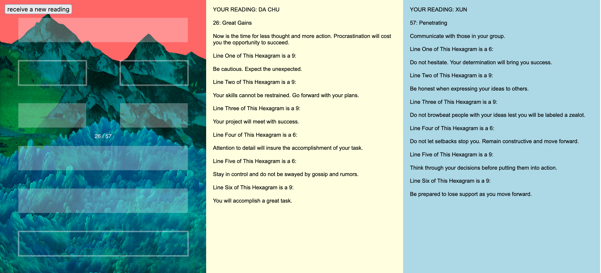
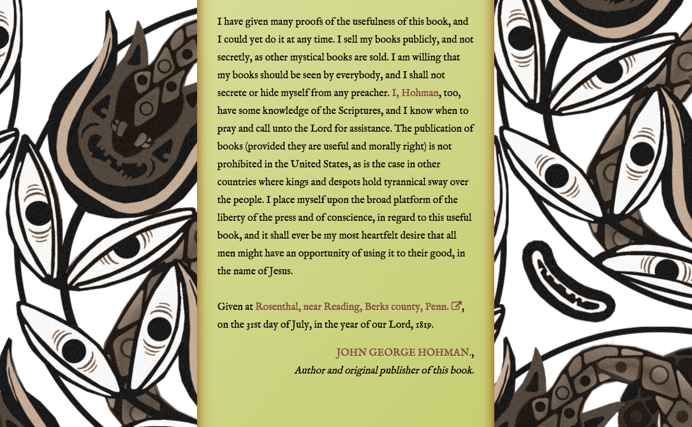
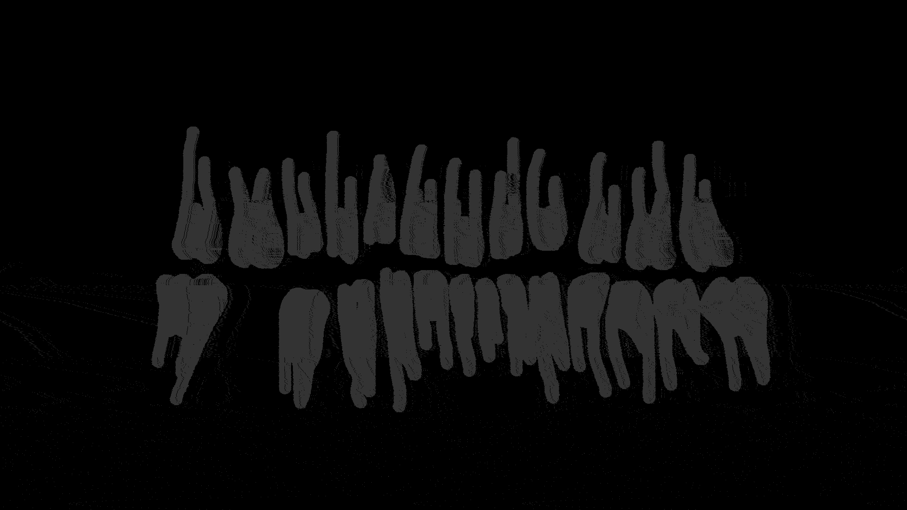
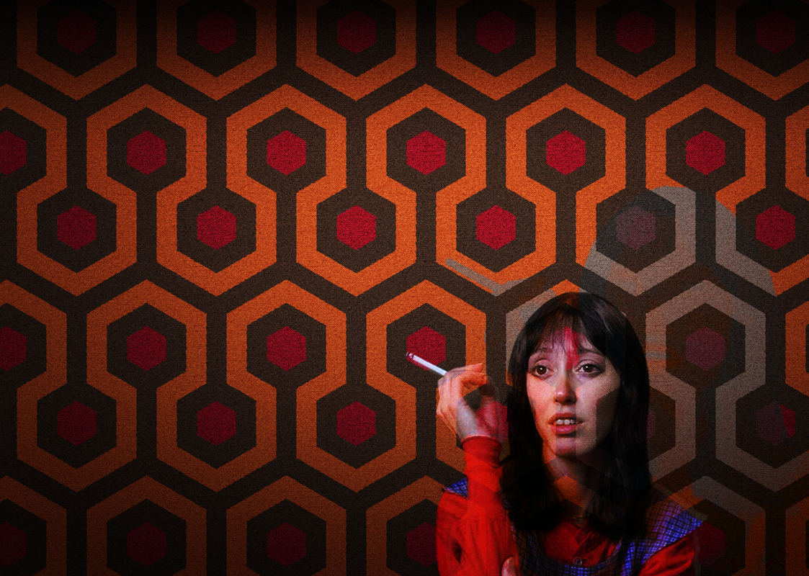
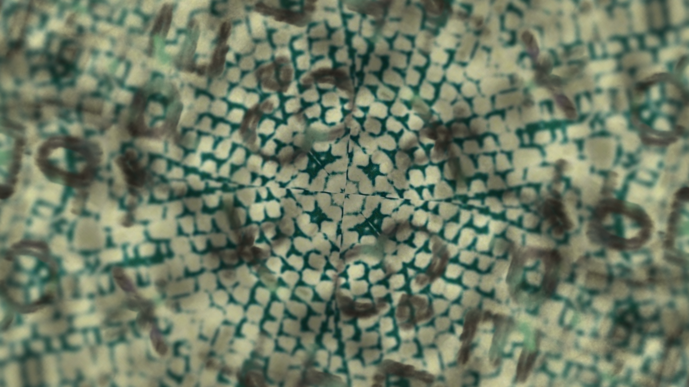

## I CHING ONLINE
#### 2016-present, website (HTML5, Processing, p5.js)

This software generates *IChing (Book of Changes)* readings for the user.  Each image provides a symbolic representation of the resultant hexigram; the images are generated through an algorithm based upon the coin-toss method of IChing divination and Lejaren Hiller’s ILLIAC II subroutine ICHING [1]. The text generated onscreen will include pertinent selections from the most popular translations and commentaries of the IChing.

The aesthetic of these generative covers is based on 1970s science-fiction pulp paperbacks. Unlike the cover art of the 1960s, 70s cover art tended toward the more surreal, psychedelic, and symbolic.  Many of these artists and authors found inspiration from Eastern philosophy – a prominent example being Philip K. Dick and his interest in IChing divination.

[I CHING ONLINE PORTAL](https://fetalcircuit.github.io/iching/)

1. This process is documented in Lejaren Hiller’s article “Programming the I-Ching oracle.” *Computer Studies in the Humanities and Verbal Behavior* 3 (1970): 130-43.

<figure>
    
    <figcaption>Installation of <em>I Ching Online</em> (right) at the Beall Center for Art + Technology; photo by Yubo Dong, courtesy of Beall Center for Art + Technology, Claire Trevor School for the Arts at UC Irvine.</figcaption>
</figure>

## INTERACTIVE FICTION/TEXT ADVENTURES
#### 2018, websites (HTML5, Processing, Twine, p5.js)

Websites/games/interactive fiction/non-fiction and text adventure experiments:
    
  <a href="https://fetalcircuit.github.io/powwow/">Pow-Wows; or, Long Lost Friend (Annotated)</a> 
  <a href="https://fetalcircuit.github.io/teethmonster/">TEETH MONSTER</a> 
  <a href="https://fetalcircuit.github.io/overlooking/">overlooking</a> 
  <a href="https://fetalcircuit.github.io/murderhouse/">murder house</a>

## GENERATIVE KALEIDOCOPE
#### 2016, website, custom software
    

These are tests of a software application, originally coded in Processing and translated to p5.js (javaScript), that collects images using the Instagram API, specified using certain tags (examples: #instakaleidoscopic), and creates generative kaleidoscopic videos from them.

[Kaleidoscope portal](https://fetalcircuit.github.io/kaleidoscope/)

## MEMENTO MAURY
#### 2015, custom software, video

<iframe src="https://player.vimeo.com/video/144545106" style="position:absolute;top:0;left:0;width:100%;height:100%;" frameborder="0" webkitallowfullscreen mozallowfullscreen allowfullscreen></iframe>

 

<iframe src="https://player.vimeo.com/video/144544127" style="position:absolute;top:0;left:0;width:100%;height:100%;" frameborder="0" webkitallowfullscreen mozallowfullscreen allowfullscreen></iframe>

Memento Maury is an exploration of gender essentialism and racial/cultural stereotyping in media as evidenced by the long-running daytime talk program <em>The Maury Povich Show</em>. By aggregating data&mdash;in this case, screenshots introducing new segments in the program&mdash;over the course of 100 episodes, one can see not only how the formulaic aspects of the show emphasize gender and racial tropes, but also how the repetition built in to popular media serves to both reflect and further ossify social and cultural hierarchical structures. Layering effects were created using custom stacking software, built with the open source programming language and development environment Processing. This is a documentation clip of the generative version of Memento Maury, screened for a full week on ACRE TV as part of the AutomataBahn series in November, 2014.

[Automatabahn archive @ acretv.org](http://www.acretv.org/category/automatabahn/)

## PISTOL MANDALA
#### 2016, custom software, video

<iframe src="https://player.vimeo.com/video/151813335" style="position:absolute;top:0;left:0;width:100%;height:100%;" frameborder="0" webkitallowfullscreen mozallowfullscreen allowfullscreen></iframe>

Pistol Mandala is a series of prints and videos produced using custom code. Videos are generative, configuring .tif images of pistols into circular mandala forms for contemplation.

## "...AND THE DAY WILL BE BEAUTIFUL"
#### 2016, digital video installation

<iframe src="https://player.vimeo.com/video/187682400" style="position:absolute;top:0;left:0;width:100%;height:100%;" frameborder="0" webkitallowfullscreen mozallowfullscreen allowfullscreen></iframe>

This video was part of a site-specific installation featured in the Em(body) Exhibition in the Uptown Arts Center. The work celebrates the legacy of Preston Bradley, whose work in the Civil Rights movement in Chicago remains startlingly relevant.

## PORTRAITS (TERMINATORS)
#### 2012, custom software, video

<iframe src="https://player.vimeo.com/video/44964225" style="position:absolute;top:0;left:0;width:100%;height:100%;" frameborder="0" webkitallowfullscreen mozallowfullscreen allowfullscreen></iframe>

Portraits (Terminators) is a video installation of 49 videos of young men's faces, but with bionic overlays (laser eyes, alloy jaws) on their features a la The Terminator. Each uploaded this content on social networking sites, creating an ad hoc community displaying their 3D tracking and modeling prowess. The tutorial they followed to produce these "portraits" begs the question, Why the Terminator? Why do they transform themselves into a militaristic cyborg, when this software is capable of an infinity of options? Or is it the software that influences the user to create such a figure?

## SANS SANS SOLEIL
#### 2010, custom software

<iframe src="https://player.vimeo.com/video/11626971" style="position:absolute;top:0;left:0;width:100%;height:100%;" frameborder="0" webkitallowfullscreen mozallowfullscreen allowfullscreen></iframe>

This visualization was inspired by Chris Marker's film <em>Sans Soleil</em>, a loosely woven narrative told through the epistolary relationship between a world traveler and a friend back home. Though the visual format of the film is described through a series of moving images cut together to form a journey through a traveler&#039;s memory, the text of the film is largely based off the letters and the inner journey they afford the reader. In this visualization, each phrase of the text is represented by a bounding phrase, or "organism," that collides with other organisms in its vicinity. Matches of similar words between phrases cause the word to appear and a web to form between organisms. The user, or "traveler," can "capture" an organism and drag it to find more matches, creating her own webs and thus a whole new narrative experience of the original text. Together both visualization and user construct any number of journeys for the fictive traveler to embrace.

[Download app](https://github.com/fetalcircuit/sanssanssoleil/releases/tag/v3.0)

## National UFO Reporting Agency reported sitings, 1925-2009
#### 2009, custom software

<iframe src="https://player.vimeo.com/video/8244687" style="position:absolute;top:0;left:0;width:100%;height:100%;" frameborder="0" webkitallowfullscreen mozallowfullscreen allowfullscreen></iframe>

National UFO Reporting Center reported sitings, 1925-2009 is an attempt to visualize the number and frequency of civilian sitings of various shapes of UFOs as reported to an official government agency. This interactive data visualization consists of two basic interfaces; the first displays the increasing frequency of various UFO shapes from the years 1925 through the present, while the second allows the user to select individual years to explore the frequency of sited shapes. While the colors representing the individual UFO shapes were chosen arbitrarily, the variation in color allows the user to differentiate between different UFOS in both interfaces, whether it be only by color, or both color and shape.
