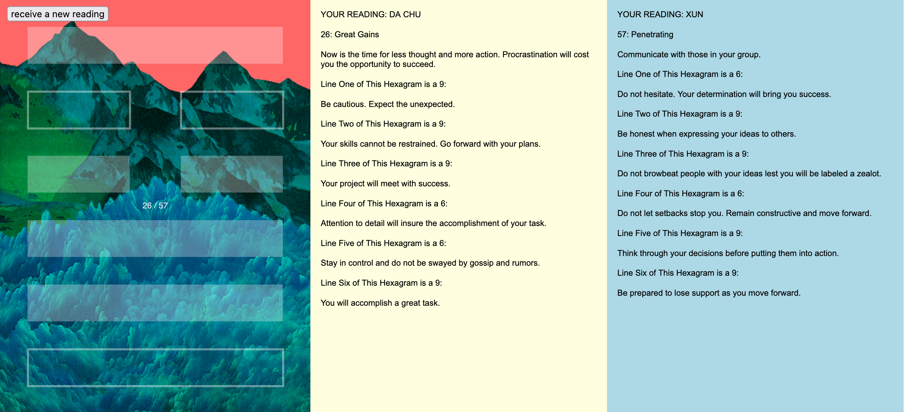
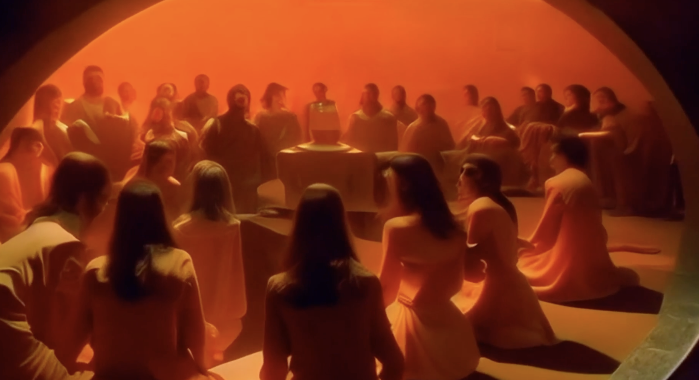
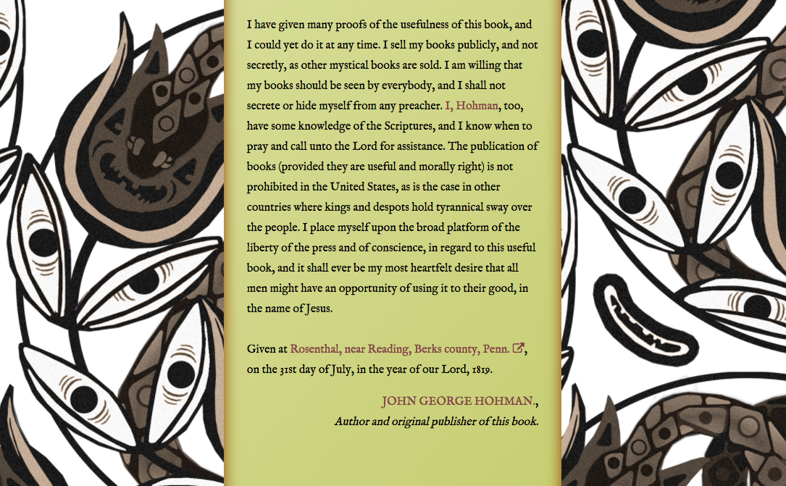
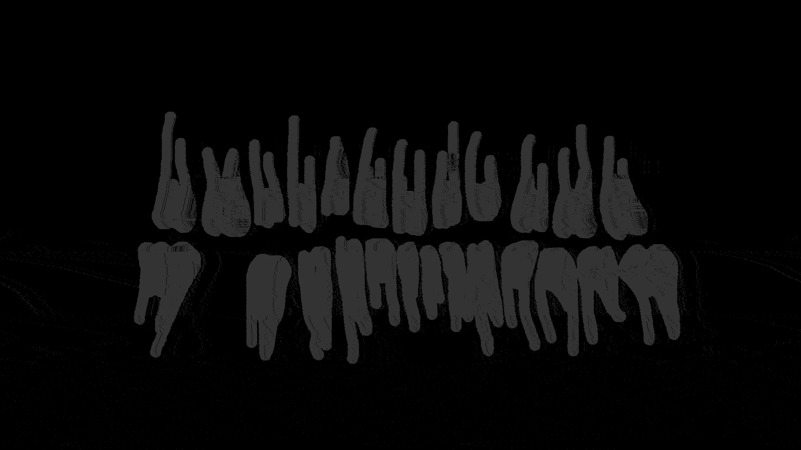
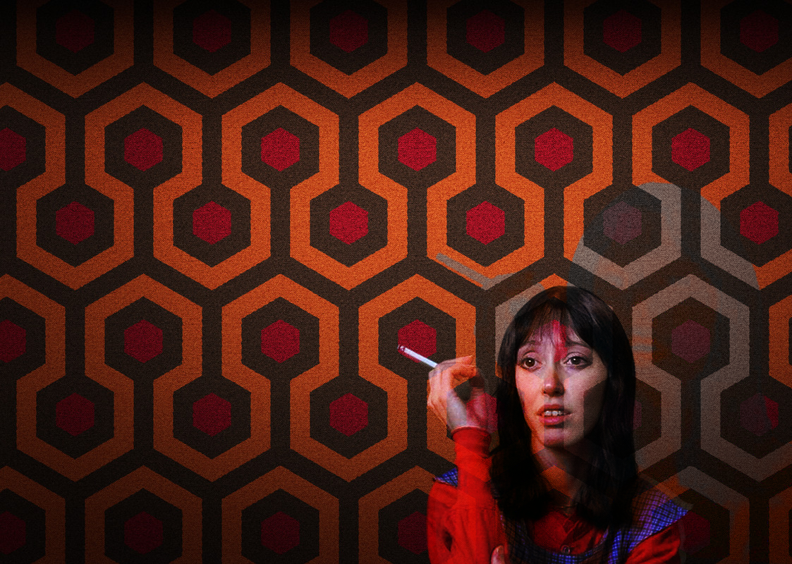
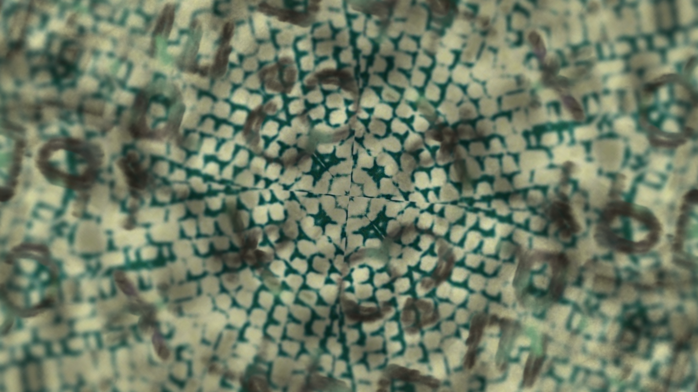

## I CHING ONLINE
2016-present, website (HTML5, Processing, p5.js)

This software generates IChing (Book of Changes) readings for the user. Each image provides a symbolic representation of the resultant hexigram; the images are generated through an algorithm based upon the coin-toss method of IChing divination and Lejaren A. Hiller Jr’s ILLIAC II subroutine ICHING, developed in 1969 at the University of Illinois for the multimedia performance HPSCHD. The text generated onscreen will include pertinent selections from the most popular translations and commentaries of the IChing.

The aesthetic of these generative covers is based on 1970s science-fiction pulp paperbacks. Unlike the cover art of the 1960s, 70s cover art tended toward the more surreal, psychedelic, and symbolic. Many of these artists and authors—Ursula K. Le Guin, Philip K. Dick, Frank Herbert, Roger Zelazny, and many others—found inspiration from Eastern philosophies and religions and helped popularize techno-Orientalism trends that continue to shape issues of race and technology in the present.

[I CHING ONLINE PORTAL](https://fetalcircuit.github.io/iching/)

1. This process is documented in Lejaren Hiller’s article “Programming the I-Ching oracle.” *Computer Studies in the Humanities and Verbal Behavior* 3 (1970): 130-43.

<figure>
    
    <figcaption>Installation of <em>I Ching Online</em> (right) at the Beall Center for Art + Technology; photo by Yubo Dong, courtesy of Beall Center for Art + Technology, Claire Trevor School for the Arts at UC Irvine.</figcaption>
</figure>

## Dance to Anything, Lake Eden
Performance at {RE}:Happening 11, Black Mountain NC, April 8, 2023

 

<blockquote class="instagram-media" data-instgrm-captioned data-instgrm-permalink="https://www.instagram.com/p/CunrwBfsD85/?utm_source=ig_embed&amp;utm_campaign=loading" data-instgrm-version="14" style=" background:#FFF; border:0; border-radius:3px; box-shadow:0 0 1px 0 rgba(0,0,0,0.5),0 1px 10px 0 rgba(0,0,0,0.15); margin: 1px; max-width:540px; min-width:326px; padding:0; width:99.375%; width:-webkit-calc(100% - 2px); width:calc(100% - 2px);">
 <a href="https://www.instagram.com/p/CunrwBfsD85/?utm_source=ig_embed&amp;utm_campaign=loading" style=" background:#FFFFFF; line-height:0; padding:0 0; text-align:center; text-decoration:none; width:100%;" target="_blank"> 
 

 
 

 

 
<svg width="50px" height="50px" viewBox="0 0 60 60" version="1.1" xmlns="https://www.w3.org/2000/svg" xmlns:xlink="https://www.w3.org/1999/xlink"><g stroke="none" stroke-width="1" fill="none" fill-rule="evenodd"><g transform="translate(-511.000000, -20.000000)" fill="#000000"><g><path d="M556.869,30.41 C554.814,30.41 553.148,32.076 553.148,34.131 C553.148,36.186 554.814,37.852 556.869,37.852 C558.924,37.852 560.59,36.186 560.59,34.131 C560.59,32.076 558.924,30.41 556.869,30.41 M541,60.657 C535.114,60.657 530.342,55.887 530.342,50 C530.342,44.114 535.114,39.342 541,39.342 C546.887,39.342 551.658,44.114 551.658,50 C551.658,55.887 546.887,60.657 541,60.657 M541,33.886 C532.1,33.886 524.886,41.1 524.886,50 C524.886,58.899 532.1,66.113 541,66.113 C549.9,66.113 557.115,58.899 557.115,50 C557.115,41.1 549.9,33.886 541,33.886 M565.378,62.101 C565.244,65.022 564.756,66.606 564.346,67.663 C563.803,69.06 563.154,70.057 562.106,71.106 C561.058,72.155 560.06,72.803 558.662,73.347 C557.607,73.757 556.021,74.244 553.102,74.378 C549.944,74.521 548.997,74.552 541,74.552 C533.003,74.552 532.056,74.521 528.898,74.378 C525.979,74.244 524.393,73.757 523.338,73.347 C521.94,72.803 520.942,72.155 519.894,71.106 C518.846,70.057 518.197,69.06 517.654,67.663 C517.244,66.606 516.755,65.022 516.623,62.101 C516.479,58.943 516.448,57.996 516.448,50 C516.448,42.003 516.479,41.056 516.623,37.899 C516.755,34.978 517.244,33.391 517.654,32.338 C518.197,30.938 518.846,29.942 519.894,28.894 C520.942,27.846 521.94,27.196 523.338,26.654 C524.393,26.244 525.979,25.756 528.898,25.623 C532.057,25.479 533.004,25.448 541,25.448 C548.997,25.448 549.943,25.479 553.102,25.623 C556.021,25.756 557.607,26.244 558.662,26.654 C560.06,27.196 561.058,27.846 562.106,28.894 C563.154,29.942 563.803,30.938 564.346,32.338 C564.756,33.391 565.244,34.978 565.378,37.899 C565.522,41.056 565.552,42.003 565.552,50 C565.552,57.996 565.522,58.943 565.378,62.101 M570.82,37.631 C570.674,34.438 570.167,32.258 569.425,30.349 C568.659,28.377 567.633,26.702 565.965,25.035 C564.297,23.368 562.623,22.342 560.652,21.575 C558.743,20.834 556.562,20.326 553.369,20.18 C550.169,20.033 549.148,20 541,20 C532.853,20 531.831,20.033 528.631,20.18 C525.438,20.326 523.257,20.834 521.349,21.575 C519.376,22.342 517.703,23.368 516.035,25.035 C514.368,26.702 513.342,28.377 512.574,30.349 C511.834,32.258 511.326,34.438 511.181,37.631 C511.035,40.831 511,41.851 511,50 C511,58.147 511.035,59.17 511.181,62.369 C511.326,65.562 511.834,67.743 512.574,69.651 C513.342,71.625 514.368,73.296 516.035,74.965 C517.703,76.634 519.376,77.658 521.349,78.425 C523.257,79.167 525.438,79.673 528.631,79.82 C531.831,79.965 532.853,80.001 541,80.001 C549.148,80.001 550.169,79.965 553.369,79.82 C556.562,79.673 558.743,79.167 560.652,78.425 C562.623,77.658 564.297,76.634 565.965,74.965 C567.633,73.296 568.659,71.625 569.425,69.651 C570.167,67.743 570.674,65.562 570.82,62.369 C570.966,59.17 571,58.147 571,50 C571,41.851 570.966,40.831 570.82,37.631"></path></g></g></g></svg>

 
View this post on Instagram

 

 

 

 

 

 

 

 

 

 
 

 

</a>
<a href="https://www.instagram.com/p/CunrwBfsD85/?utm_source=ig_embed&amp;utm_campaign=loading" style=" color:#c9c8cd; font-family:Arial,sans-serif; font-size:14px; font-style:normal; font-weight:normal; line-height:17px; text-decoration:none;" target="_blank">A post shared by Chris Reeeeves (@otherchrisreeves)</a>

</blockquote>

Description:

Dance to Anything is a dynamic constellation of visual artists, writers/readers, and movement makers responding to sound works that have been crafted to be difficult to dance to. This sonic constraint response project was designed and organized to think less about choreography in a general sense, but how shared translations of a choreographic object (the sound works) move relational possibilities. Some of the ideas, questions, and metaphors we might conjure up from this attempted endeavor: How might we find joy in the not legibly functional in art? What are dance-tos and dance-nots? Why is movement thought of as secondary to form? What gestures, minor/major or otherwise, when explored relationally, elicit and inspire potential politics to come?

Collaboration with Anna Johnson, Camille Casemier, Chris Reeves, Jesse Malmed, Lauren Sudbrink, Lula Asplund, & Maggie Wong

## Fetal Circuit
<iframe width="100%" height="300" scrolling="no" frameborder="no" allow="autoplay" src="https://w.soundcloud.com/player/?url=https%3A//api.soundcloud.com/playlists/1615870729&color=%23ff5500&auto_play=false&hide_related=false&show_comments=true&show_user=true&show_reposts=false&show_teaser=true&visual=true"></iframe>
<a href="https://soundcloud.com/fetalcircuit" title="Fetal Circuit" target="_blank" style="color: #cccccc; text-decoration: none;">Fetal Circuit</a> · <a href="https://soundcloud.com/fetalcircuit/sets/we-live-underground" title="we live underground" target="_blank" style="color: #cccccc; text-decoration: none;">we live underground</a>

<iframe width="100%" height="300" scrolling="no" frameborder="no" allow="autoplay" src="https://w.soundcloud.com/player/?url=https%3A//api.soundcloud.com/tracks/1507555207&color=%23ff5500&auto_play=false&hide_related=false&show_comments=true&show_user=true&show_reposts=false&show_teaser=true&visual=true"></iframe>
<a href="https://soundcloud.com/fetalcircuit" title="Fetal Circuit" target="_blank" style="color: #cccccc; text-decoration: none;">Fetal Circuit</a> · <a href="https://soundcloud.com/fetalcircuit/organ-motor-room-part-1" title="organ motor room (part 1)" target="_blank" style="color: #cccccc; text-decoration: none;">organ motor room (part 1)</a>

Fetal Circuit is an experimental soundscape and dark ambient project in creating soundtracks for existing and speculative horror tabletop roleplaying and video games, performances, and installations. The most recent EP, we live underground, features tape loops and custom-built analog noise machines and instruments.

## video game sketches
ongoing, video games ([bitsy game engine](https://github.com/le-doux/bitsy))

Short retro-game sketches in game engine Bitsy.org.

<iframe frameborder="0" src="https://itch.io/embed/2377357" width="552" height="167"><a href="https://funkstart.itch.io/punk-show">Punk Show by funkstart</a></iframe>
<iframe src="https://itch.io/embed/2377327" width="552" height="167" frameborder="0"><a href="https://funkstart.itch.io/i-went-to-mars">I Went to Mars by funkstart</a></iframe>
<iframe src="https://itch.io/embed/2369753" width="552" height="167" frameborder="0"><a href="https://funkstart.itch.io/old-macdonald">Old MacDonald by funkstart</a></iframe>

## ORACLE I
2023, video (ChatGPT, Runway AI, custom sound hardware)

<iframe src="https://player.vimeo.com/video/881078741?badge=0&amp;autopause=0&amp;quality_selector=1&amp;player_id=0&amp;app_id=58479" frameborder="0" allow="autoplay; fullscreen; picture-in-picture" style="position:absolute;top:0;left:0;width:100%;height:100%;" title="Oracle I"></iframe>

Oracle I was generated using AI video generation software using prompts from ICHING (Book of Changes) passages alongside stylistic markers of 1970s sci-fi cinema. The resultant videos are edited together to create a retro-futuristic trailer for a speculative film exploring a future of the past, where hollow beings flit in and out of setpieces referencing forever wars, forbidden love, and techno-colonialism.

## INTERACTIVE FICTION/TEXT ADVENTURES
2018, websites (HTML5, Processing, Twine, p5.js)

Websites/games/interactive fiction/non-fiction and text adventure experiments:
    
  <a href="https://fetalcircuit.github.io/powwow/">Pow-Wows; or, Long Lost Friend (Annotated)</a> 
  <a href="https://fetalcircuit.github.io/teethmonster/">TEETH MONSTER</a> 
  <a href="https://fetalcircuit.github.io/overlooking/">overlooking</a> 
  <a href="https://fetalcircuit.github.io/murderhouse/">murder house</a>

## GENERATIVE KALEIDOCOPE
2016, website, custom software
    

These are tests of a software application, originally coded in Processing and translated to p5.js (javaScript), that collects images using the Instagram API, specified using certain tags (examples: #instakaleidoscopic), and creates generative kaleidoscopic videos from them.

[Kaleidoscope portal](https://fetalcircuit.github.io/kaleidoscope/)

## MEMENTO MAURY
2015, custom software, video

<iframe src="https://player.vimeo.com/video/144545106" style="position:absolute;top:0;left:0;width:100%;height:100%;" frameborder="0" webkitallowfullscreen mozallowfullscreen allowfullscreen></iframe>

 

<iframe src="https://player.vimeo.com/video/144544127" style="position:absolute;top:0;left:0;width:100%;height:100%;" frameborder="0" webkitallowfullscreen mozallowfullscreen allowfullscreen></iframe>

Memento Maury is an exploration of gender essentialism and racial/cultural stereotyping in media as evidenced by the long-running daytime talk program <em>The Maury Povich Show</em>. By aggregating data&mdash;in this case, screenshots introducing new segments in the program&mdash;over the course of 100 episodes, one can see not only how the formulaic aspects of the show emphasize gender and racial tropes, but also how the repetition built in to popular media serves to both reflect and further ossify social and cultural hierarchical structures. Layering effects were created using custom stacking software, built with the open source programming language and development environment Processing. This is a documentation clip of the generative version of Memento Maury, screened for a full week on ACRE TV as part of the AutomataBahn series in November, 2014.

[Automatabahn archive @ acretv.org](http://www.acretv.org/category/automatabahn/)

## PISTOL MANDALA
2016, custom software, video

<iframe src="https://player.vimeo.com/video/151813335" style="position:absolute;top:0;left:0;width:100%;height:100%;" frameborder="0" webkitallowfullscreen mozallowfullscreen allowfullscreen></iframe>

Pistol Mandala is a series of prints and videos produced using custom code. Videos are generative, configuring .tif images of pistols into circular mandala forms for contemplation.

## "...AND THE DAY WILL BE BEAUTIFUL"
2016, digital video installation

<iframe src="https://player.vimeo.com/video/187682400" style="position:absolute;top:0;left:0;width:100%;height:100%;" frameborder="0" webkitallowfullscreen mozallowfullscreen allowfullscreen></iframe>

This video was part of a site-specific installation featured in the Em(body) Exhibition in the Uptown Arts Center. The work celebrates the legacy of Preston Bradley, whose work in the Civil Rights movement in Chicago remains startlingly relevant.

## PORTRAITS (TERMINATORS)
2012, custom software, video

<iframe src="https://player.vimeo.com/video/44964225" style="position:absolute;top:0;left:0;width:100%;height:100%;" frameborder="0" webkitallowfullscreen mozallowfullscreen allowfullscreen></iframe>

Portraits (Terminators) is a video installation of 49 videos of young men's faces, but with bionic overlays (laser eyes, alloy jaws) on their features a la The Terminator. Each uploaded this content on social networking sites, creating an ad hoc community displaying their 3D tracking and modeling prowess. The tutorial they followed to produce these "portraits" begs the question, Why the Terminator? Why do they transform themselves into a militaristic cyborg, when this software is capable of an infinity of options? Or is it the software that influences the user to create such a figure?

## SANS SANS SOLEIL
2010, custom software

<iframe src="https://player.vimeo.com/video/11626971" style="position:absolute;top:0;left:0;width:100%;height:100%;" frameborder="0" webkitallowfullscreen mozallowfullscreen allowfullscreen></iframe>

This visualization was inspired by Chris Marker's film <em>Sans Soleil</em>, a loosely woven narrative told through the epistolary relationship between a world traveler and a friend back home. Though the visual format of the film is described through a series of moving images cut together to form a journey through a traveler&#039;s memory, the text of the film is largely based off the letters and the inner journey they afford the reader. In this visualization, each phrase of the text is represented by a bounding phrase, or "organism," that collides with other organisms in its vicinity. Matches of similar words between phrases cause the word to appear and a web to form between organisms. The user, or "traveler," can "capture" an organism and drag it to find more matches, creating her own webs and thus a whole new narrative experience of the original text. Together both visualization and user construct any number of journeys for the fictive traveler to embrace.

[Download app](https://github.com/fetalcircuit/sanssanssoleil/releases/tag/v3.0)

## National UFO Reporting Agency reported sitings, 1925-2009
2009, custom software

<iframe src="https://player.vimeo.com/video/8244687" style="position:absolute;top:0;left:0;width:100%;height:100%;" frameborder="0" webkitallowfullscreen mozallowfullscreen allowfullscreen></iframe>

National UFO Reporting Center reported sitings, 1925-2009 is an attempt to visualize the number and frequency of civilian sitings of various shapes of UFOs as reported to an official government agency. This interactive data visualization consists of two basic interfaces; the first displays the increasing frequency of various UFO shapes from the years 1925 through the present, while the second allows the user to select individual years to explore the frequency of sited shapes. While the colors representing the individual UFO shapes were chosen arbitrarily, the variation in color allows the user to differentiate between different UFOS in both interfaces, whether it be only by color, or both color and shape.
